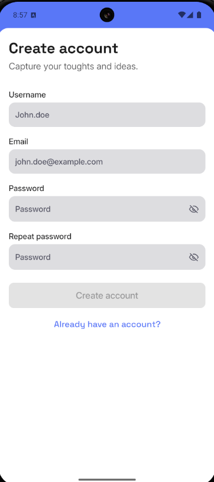
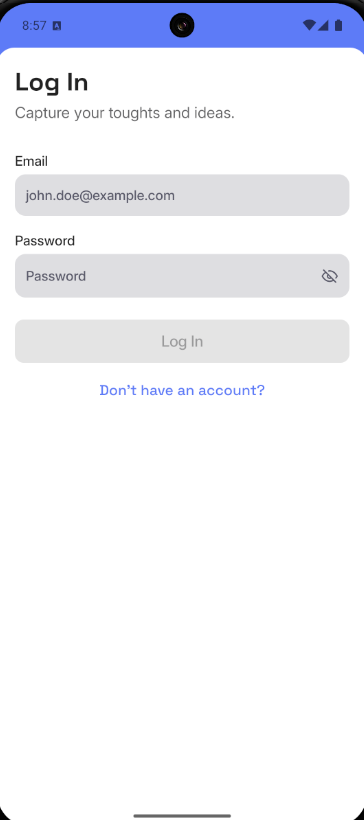
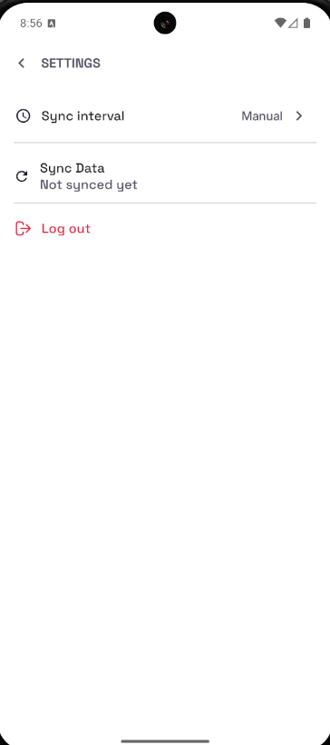

# Notemark - Note Taking App


A modern note-taking application with user authentication, real-time sync, and offline capabilities.

## Features

### Core Functionality
- 🔐 Secure user authentication (Register/Login)
- 📝 Create, edit, and delete notes
- 🔍 View notes in list and detail views
- ⚙️ User settings management
- 🌐 Online/offline synchronization

### Screens
| Register Screen | Login Screen | Notes Screen |
|-----------------|--------------|--------------|
|  |  |  |

| Detail Screen | Settings Screen |
|--------------------|-----------------|
|  |  |

## Technical Stack

### Frontend
- **Kotlin** - Primary programming language
- **Jetpack Compose** - Modern UI toolkit
- **ViewModel** - UI-related data holder

### Architecture
- **Clean Architecture** - Separation of concerns
- **Repository Pattern** - Data abstraction
- **Offline-First** - Robust sync system

## Installation

1. Clone the repository:
   ```bash
   git clone https://github.com/yourusername/notemark.git